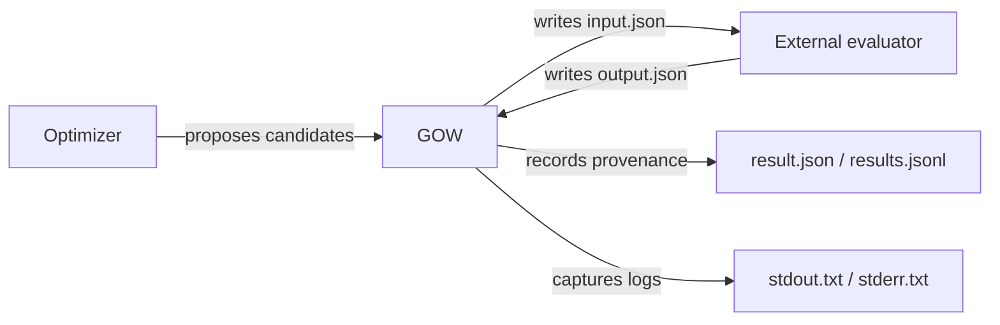
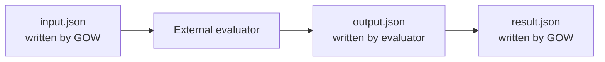
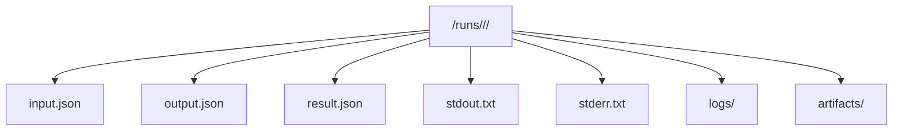

# GOW: Architecture, Evaluator Contract, and Provenance

*The execution model behind reproducible optimization runs*

Optimization algorithms are only one part of an optimization system. Every run also needs an execution layer that can launch evaluations, record outcomes, and preserve enough context to reproduce results later.

The **Generic Optimization Workflow (GOW)** provides that execution layer. It does not implement simulation-specific logic, and it does not require evaluators to be embedded into the framework. Instead, it orchestrates external evaluators under a small, explicit contract.

This post is the canonical reference for:

- the GOW architecture
- the evaluator contract
- identifiers and experiment hierarchy
- filesystem provenance
- the failure model

For environment setup and platform-specific evaluator execution, see:

- **[Running GOW with External Evaluators on Windows, Linux, and macOS](/running-gow-with-external-evaluators)**
- **[Installing GOW and Choosing a Backend](/gow-installation-and-backends)**

<!-- truncate -->

---

## System Architecture

GOW separates three responsibilities:

- the **optimizer** proposes candidate parameter sets
- **GOW** orchestrates execution and records provenance
- the **evaluator** computes the objective and any additional metrics



This separation is the core design choice:

- the optimizer does not need to know how evaluations are executed
- the evaluator does not need to know how candidates are proposed
- GOW does not need evaluator-specific domain logic

As a result, the same workflow model can drive simple Python scripts, compiled executables, or larger simulation pipelines.

---

## The Evaluator Contract

GOW interacts with evaluators through a file-based contract. For each candidate evaluation, GOW creates a working directory and expects the evaluator to follow three steps:

1. Read `input.json`
2. Perform the evaluation
3. Write `output.json`

That is the entire required interface.



This design keeps evaluators independent from GOW while allowing GOW to manage execution, record outputs, and classify failures.

### Input File

GOW writes `input.json` before launching the evaluator.

Example:

```json
{
  "run_id": "7c3f3a2a-7c40-4c7b-b9c6-5b02f3b6c6d0",
  "candidate_id": "r7c3f3a2a_g000002_c000014",
  "candidate_local_id": "g000002_c000014",
  "attempt_id": "r7c3f3a2a_g000002_c000014_a000",
  "params": {
    "x": 0.5,
    "y": -0.25
  },
  "context": {}
}
```

The evaluator reads this file to obtain candidate parameters and run metadata.

### Output File

The evaluator writes `output.json`.

Example:

```json
{
  "status": "ok",
  "objective": 0.3125,
  "metrics": {
    "sphere": 0.3125
  },
  "constraints": {},
  "artifacts": {}
}
```

The `objective` field is the scalar value used by the optimizer. The `metrics` field is the broader result payload that can include additional values for analysis or reporting.

### Objective vs Metrics

| Field | Meaning |
|---|---|
| `objective` | scalar value consumed by the optimizer |
| `metrics` | additional evaluator output preserved for inspection |

In practice:

- successful evaluations should provide `objective`
- failed evaluations may omit it or set it to `null`
- `objective` may duplicate one metric, but it has a distinct role in optimization

---

## Run, Candidate, and Attempt

GOW uses a simple experiment hierarchy:

```text
Run
  Candidate
    Attempt
```

### Run

A **run** is one optimization experiment.

### Candidate

A **candidate** is one logical parameter set proposed by the optimizer.

### Attempt

An **attempt** is one concrete execution of a candidate.

This distinction matters because the same candidate may be executed more than once during debugging, manual reruns, or future retry-aware workflows.

---

## Identifiers

GOW uses structured identifiers that remain readable in logs, paths, and provenance files.

Example candidate identifier:

```text
r7c3f3a2a_g000002_c000014
```

Meaning:

- `r7c3f3a2a` -> short token derived from the run identifier
- `g000002` -> generation identifier
- `c000014` -> zero-based candidate index within the run

Attempt identifiers extend the candidate identifier:

```text
r7c3f3a2a_g000002_c000014_a000
```

This fixed-width form keeps lexical sorting aligned with execution order and makes provenance easier to inspect by eye.

---

## Filesystem Provenance

Every candidate evaluation leaves a trace on disk. That trace is part of the workflow model, not only a debugging aid.

A typical candidate directory looks like:

```text
<outdir>/runs/<run_id>/<candidate_id>/
  input.json
  output.json
  result.json
  stdout.txt
  stderr.txt
  logs/
  artifacts/
```



### Files Written by GOW

- `input.json`  
  Candidate parameters and metadata passed to the evaluator.

- `result.json`  
  Execution metadata recorded by GOW, including identifiers, timestamps, runtime statistics, and failure classification when applicable.

- `stdout.txt`  
  Standard output captured from the evaluator process.

- `stderr.txt`  
  Standard error captured from the evaluator process.

### Files Written by the Evaluator

- `output.json`  
  The evaluator result payload, including the objective value and any additional metrics.

### Optional Evaluator Directories

- `logs/`  
  Additional evaluator-generated logs.

- `artifacts/`  
  Generated files such as plots, simulation outputs, or intermediate analysis results.

GOW does not impose internal structure on `logs/` or `artifacts/`; that layout belongs to the evaluator.

### Aggregate Provenance

In addition to per-candidate files, GOW maintains an aggregate record:

```text
<outdir>/results.jsonl
```

Each line is a JSON record describing one evaluation. This makes the run easy to analyze with standard data tools.

For example:

```python
import json

with open("results.jsonl") as f:
    records = [json.loads(line) for line in f]
```

---

## Failure Model

Evaluations can fail for several reasons:

- the process exits with a non-zero status
- the evaluator does not write `output.json`
- the output file is malformed or incomplete
- the evaluation exceeds its allowed runtime

GOW classifies common wrapper-detected failure modes using machine-readable categories such as:

```text
missing_output
nonzero_exit
invalid_output
timeout
```

These categories make failures easier to diagnose and preserve structure for downstream tooling and future retry-aware workflows.

### Why the Failure Model Matters

Without structured failure recording, optimization logs become hard to interpret:

- it is unclear whether a candidate was bad or merely failed to execute
- repeated operational failures are difficult to spot across large runs
- manual debugging lacks context about which candidate and attempt produced the error

By recording failure metadata alongside normal outputs, GOW makes unsuccessful evaluations inspectable rather than invisible.

---

## Summary

GOW provides a workflow layer around optimization rather than another optimizer implementation. Its main responsibilities are:

- launching external evaluators through a stable contract
- preserving identifiers and execution history
- recording candidate-level provenance on disk
- classifying failures in a structured way

For runtime setup and backend selection, continue with:

- **[Running GOW with External Evaluators on Windows, Linux, and macOS](/running-gow-with-external-evaluators)**
- **[Installing GOW and Choosing a Backend](/gow-installation-and-backends)**
