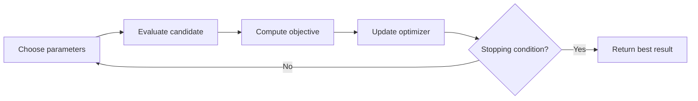
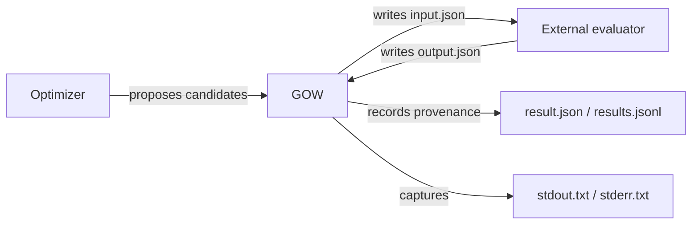
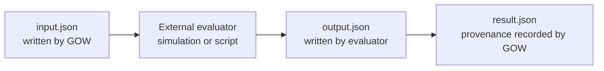
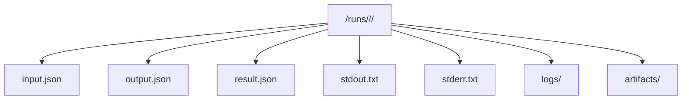
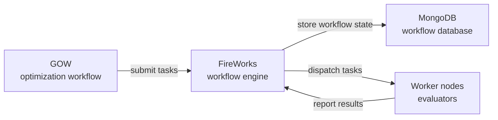

# Introducing the Generic Optimization Workflow (GOW)

*Reproducible, evaluator-agnostic orchestration for optimization experiments*

Optimization problems appear everywhere in science and engineering. Researchers routinely search for parameter values that maximize performance, minimize error, or satisfy design constraints.


Examples include:

- tuning parameters of a physical simulation
- optimizing the geometry of a device
- calibrating a model against experimental data
- minimizing energy consumption in a system

Although the underlying optimization algorithms are well studied, **running optimization experiments reliably is often an operational challenge**. Evaluations may involve external simulators, large numbers of experiments, distributed computing resources, and careful tracking of results.


<!-- truncate -->

---

## A Typical Optimization Loop



Most optimization processes follow a simple iterative loop:

1. Propose a set of parameters.
2. Evaluate those parameters using a simulation, experiment, or model.
3. Compute a scalar score that measures the quality of the result.
4. Use an optimization algorithm to propose improved parameters.
5. Repeat until a stopping condition is reached.

That scalar score is the **objective** — the quantity the optimizer attempts to minimize or maximize.

Typical objectives include:

- minimizing simulation error
- maximizing efficiency
- minimizing cost
- maximizing performance

In each iteration, the optimizer proposes candidate parameter sets, evaluates them, and uses the resulting objective values to guide the search.

Conceptually this loop is straightforward. In practice, however, executing it reliably at scale introduces significant operational challenges.

---

## When Optimization Becomes Operationally Difficult

The conceptual optimization loop is simple. Executing it reliably in real experiments is often not.

In practice, optimization experiments frequently involve:

- running external simulators, experiments, or analysis codes
- executing hundreds or thousands of candidate evaluations
- handling failures from simulators or runtime environments
- running experiments on local machines, clusters, or HPC systems
- tracking which parameter sets produced which results
- preserving sufficient provenance to reproduce results later

As a result, the surrounding workflow infrastructure can easily become more complex than the optimization algorithm itself.

---

## What GOW Does

The **Generic Optimization Workflow (GOW)** is designed to address the operational challenges of running optimization experiments.

GOW introduces a workflow layer between the optimizer and the evaluation code. Its role is to orchestrate candidate evaluations, manage execution environments, and record the provenance of each evaluation.

Conceptually, the system separates responsibilities into three components:

- the **optimizer** proposes candidate parameter sets
- the **evaluator** computes objectives and metrics
- **GOW** orchestrates execution and records provenance

In this architecture, GOW does not implement the optimization algorithm itself, nor does it embed simulation logic. Instead, it manages the workflow that connects the two.

Evaluators remain independent programs. Rather than requiring evaluators to be integrated into the framework, GOW executes them as external processes under a simple file-based contract.

---

## Design Principles

### Evaluator-Agnostic Architecture

GOW executes external evaluators rather than embedding simulation-specific logic inside the framework.

An evaluator only needs to follow a minimal contract:

1. read `input.json`
2. perform the evaluation
3. write `output.json`

That makes GOW compatible with:

- Python scripts
- compiled programs
- simulation frameworks
- cluster-oriented workflows

Any program can serve as an evaluator as long as it respects the file-based contract.

### Reproducibility and Provenance

Every evaluation executed by GOW leaves a trace on disk.

This includes:

- the input parameters
- the evaluator output
- execution timestamps
- captured stdout/stderr
- machine-readable failure categories
- structured identifiers linking the evaluation back to the run

Together, these artifacts form the provenance layer of the workflow.

They allow users to answer questions such as:

- which parameters produced this result?
- when was this evaluation executed?
- which run generated this candidate?
- what happened when an evaluation failed?

By preserving this information automatically, GOW makes optimization experiments inspectable, reproducible, and easier to debug.

### Clear Experiment Hierarchy

GOW uses a simple conceptual hierarchy:

```text
Run
  Candidate
    Attempt
```

#### Run

A **run** represents one optimization experiment.

#### Candidate

A **candidate** is a logical parameter set proposed by the optimizer.

#### Attempt

An **attempt** represents one concrete execution of a candidate.

This distinction matters because a candidate may be executed more than once, For example, a candidate may be retried after a failure or re-executed during manual debugging.

In the current implementation, attempts are tracked in identifiers and provenance records, while the working directory remains candidate-scoped.

### Human-Readable Identifiers

GOW uses structured identifiers that are readable in logs, filesystem paths, and provenance files.

Example candidate identifier:

```text
r7c3f3a2a_g000002_c000014
```

Meaning:

- `r7c3f3a2a` -> short token derived from the run identifier
- `g000002` -> generation identifier
- `c000014` -> zero-based global candidate sequence number within the run

Attempts extend the candidate identifier:

```text
r7c3f3a2a_g000002_c000014_a000
```

Identifiers are generated in fixed-width canonical form to maintain consistent sorting and readability.

Parsing remains flexible for backward compatibility, allowing legacy or non-padded identifiers to be interpreted when needed.

### Backend Flexibility

GOW supports two execution backends:

- local execution
- distributed execution using FireWorks

FireWorks support is optional and requires the optional FireWorks dependency/extra.

This design allows the same workflow model to scale from laptops to workstations to HPC environments without changing the evaluator implementation.

---

## System Architecture

The GOW architecture separates optimization logic from evaluation logic.

The optimizer proposes candidate parameter sets, while GOW manages the execution workflow and records the resulting provenance. The evaluator performs the actual computation of objectives and metrics.



Conceptually, the interaction can be summarized as:

```text
Optimizer -> GOW -> Evaluator -> Results
```

| Component | Responsibility |
|-----------|---------------|
| Optimizer | proposes parameter candidates |
| GOW | orchestrates evaluation workflow |
| Evaluator | computes objective and metrics |
| Result records | store provenance and execution history |

The evaluator remains independent from both GOW and the optimizer, allowing existing simulation codes or analysis tools to be integrated without modification.

---

## The Optimization Specification

Before running an optimization, GOW must know how the optimization problem is defined. This information is provided through an **optimization specification file**.

This specification defines the optimization problem, the evaluator that executes candidate evaluations, and the optimizer that proposes new parameter sets.

In practice the specification is typically written as a **YAML file** such as:

```text
examples/toy/optimization_specs.yaml
```

The same structured content could also be expressed in JSON, but YAML is the recommended format because it is easier to read and edit manually. The choice between YAML and JSON affects only the serialization syntax; the logical structure of the configuration remains the same.

The specification follows a defined schema validated internally by GOW. The main top-level sections are:

- `id` — identifier of the optimization problem
- `objective` — definition of the optimization objective
- `parameters` — definition of the parameter space
- `evaluator` — command used to evaluate candidates
- `optimizer` — configuration of the optimization algorithm
- `context` — optional user metadata

A simplified example illustrating these sections is shown below.

```yaml
id: toy-sphere-de

objective:
  direction: minimize

parameters:
  x:
    type: real
    value: 0.1
    bounds: [-5.0, 5.0]

  y:
    type: real
    value: -0.2
    bounds: [-5.0, 5.0]

  n:
    type: int
    value: 5
    optimizable: false

evaluator:
  command: ["{python}", "evaluator.py"]
  timeout_s: 60
  env:
    OMP_NUM_THREADS: "1"

optimizer:
  name: differential_evolution
  seed: 123
  max_evaluations: 1000
  batch_size: 100

context:
  note: "example optimization problem"
```

The roles of the sections are the following.

### Problem Identifier

The `id` field uniquely identifies the optimization problem. It is used in provenance records and logs to track the origin of optimization runs.

### Objective Definition

The `objective` section specifies how candidate solutions should be compared.

In the current implementation, this section supports a single setting:

- `direction`: whether the objective should be **minimized** or **maximized**

The allowed values are `minimize` and `maximize`.

Example:

```yaml
objective:
  direction: minimize
```

the objective section does not define how the evaluator computes the objective. It only tells GOW and the optimizer **how to interpret** the scalar objective returned by the evaluator.

### Parameter Definitions

The `parameters` section defines the **search space** explored by the optimizer. Each parameter is described by a configuration block whose fields depend on the parameter type.

All parameters share the following common fields:

- `type` — parameter type (`real`, `int`, or `categorical`)
- `value` — default or initial value used when constructing candidate evaluations
- `optimizable` — whether the optimizer is allowed to modify the parameter (defaults to `true`)

The `value` field provides a default value for the parameter and may serve as an initial point for optimization. Even when a parameter is optimizable, the optimizer may propose values different from the default during the search.

When `optimizable` is set to `false`, the parameter is treated as fixed and the specified `value` will be used in all candidate evaluations.

Additional fields depend on the parameter type.

#### Real Parameters

Real parameters represent continuous values. When a real parameter is optimizable, the valid search interval must be defined using `bounds`.

```yaml
x:
  type: real
  value: 0.1
  bounds: [-5.0, 5.0]
```

Fields:

- `bounds` — lower and upper limits of the allowed range

The optimizer will propose candidate values within the specified interval.

#### Integer Parameters

Integer parameters represent discrete numeric values. As with real parameters, optimizable integer parameters require bounds.

```yaml
n:
  type: int
  value: 5
  bounds: [1, 20]
```

Fields:

- `bounds` — lower and upper limits of the integer search range

The optimizer will generate integer candidate values within these bounds.

#### Categorical Parameters

Categorical parameters represent values chosen from a finite set of options.

```yaml
mode:
  type: categorical
  value: fast
  choices: [fast, accurate]
```

Fields:

- `choices` — list of allowed categorical values

The optimizer will select among the provided options when generating candidate solutions.

#### Fixed Parameters

Parameters can be marked as fixed by setting:

```yaml
learning_rate:
  type: real
  value: 0.01
  optimizable: false
```

In this case the optimizer will treat the parameter as constant and will not attempt to modify it during the optimization process.

#### Bounds Are Not Required for Fixed Parameters

When a parameter is marked with `optimizable: false`, it is treated as constant during the optimization process.

Since the optimizer will never modify the parameter, no search space needs to be defined and fields such as `bounds` or `choices` are not required.

Example:

```yaml
parameters:
  temperature:
    type: real
    value: 300
    optimizable: false
```

### Evaluator Configuration

The `evaluator` section defines the external program that evaluates a candidate.

The evaluator must follow the GOW evaluator contract:

- read `input.json`
- perform the evaluation
- write `output.json`

The evaluator execution flow is illustrated below:



GOW prepares the evaluation environment by writing `input.json`, executes the evaluator command, and then records the results once the evaluator produces `output.json`.

Example configuration:

```yaml
evaluator:
  command: ["{python}", "evaluator.py"]
  timeout_s: 60
```

The `command` field is a list representing the command to execute.

The special placeholder `{python}` is replaced at runtime with the Python interpreter used to launch the GOW command-line interface. Internally, GOW resolves this placeholder to the current Python executable (equivalent to `sys.executable`). This ensures that the evaluator runs in the same Python environment as GOW, which is particularly useful when using virtual environments or editable installations.

If the evaluator is not a Python program, the command can simply reference the executable directly.

evaluator:
  command: ["./simulate.sh"]

Optional fields allow additional control over how the evaluator is executed.

These fields modify the runtime environment in which the evaluator command is launched.

#### `timeout_s`

The `timeout_s` field specifies the maximum time allowed for a single evaluation.

If the evaluator runs longer than the specified number of seconds, GOW terminates the process and records the evaluation as a timeout failure.

Example:

```yaml
evaluator:
  command: ["{python}", "evaluator.py"]
  timeout_s: 60
```

In this case each candidate evaluation must finish within 60 seconds. If the evaluator exceeds this limit, GOW stops the process and marks the evaluation as failed with a timeout status.

This option is useful when evaluations may occasionally hang or run indefinitely.

#### `env`

The `env` field allows environment variables to be defined for the evaluator process.

These variables are set only for the evaluator execution and do not modify the global environment of the GOW process.

Example:

```yaml
evaluator:
  command: ["{python}", "evaluator.py"]
  env:
    OMP_NUM_THREADS: "1"
    MKL_NUM_THREADS: "1"
```

This example forces the evaluator to run with a single thread when using libraries such as OpenMP or Intel MKL. This can be useful when running many evaluations in parallel to avoid oversubscribing CPU resources.

Environment variables can also be used to configure simulation software or provide runtime configuration parameters.

#### `extra_args`

The `extra_args` field allows additional arguments to be appended to the evaluator command.

Example:

```yaml
evaluator:
  command: ["{python}", "evaluator.py"]
  extra_args: ["--precision", "high"]
```

In this case GOW will execute the equivalent of:

```text
python evaluator.py --precision high
```

This option is useful when the evaluator program accepts command-line arguments that are independent of the optimization parameters.

### Optimizer Configuration

The `optimizer` section defines how candidate solutions are generated.

Example:

```yaml
optimizer:
  name: differential_evolution
  seed: 123
  max_evaluations: 1000
  batch_size: 100

  settings:
    mutation_factor: 0.8
    crossover_rate: 0.9
    max_generations: 10
```

The `settings` field allows optimizer-specific parameters to be passed through to the optimization algorithm.

### Context Metadata

The optional `context` section allows users to include arbitrary metadata about the optimization problem. This information is preserved in provenance records but does not affect the optimization itself.

Example:

```yaml
context:
  note: "toy example using Differential Evolution"
```

Once this specification is loaded, GOW constructs the optimization problem internally. The optimizer proposes candidate parameter sets within the defined search space, and GOW materializes each candidate evaluation by writing the selected parameter values and run metadata to `input.json`.

### Validation Rules and Common Mistakes

GOW validates optimization specifications when they are loaded. If the specification does not satisfy the expected schema, the run will fail early with a configuration error.

The following rules are important when writing a specification file.

#### Every specification must include the required top-level sections

A valid specification must define at least:

- `id`
- `objective`
- `parameters`
- `evaluator`
- `optimizer`

If any of these sections are missing, GOW will reject the specification.

#### Optimizable parameters must define bounds

When a parameter is marked as optimizable (or when `optimizable` is omitted and defaults to true), the optimizer must know the valid search range.

Example:

```yaml
x:
  type: real
  value: 0.1
  bounds: [-5.0, 5.0]
```

If bounds are omitted for an optimizable numeric parameter, the optimizer cannot construct the search space.

#### Parameter types must match the allowed values

GOW supports three parameter types:

- `real`
- `int`
- `categorical`

Examples:

```yaml
learning_rate:
  type: real
  bounds: [0.0001, 0.1]

batch_size:
  type: int
  bounds: [8, 128]

mode:
  type: categorical
  choices: [fast, accurate]
```

Using an unsupported type will cause validation to fail.

#### Default parameter values should lie within bounds

When a default `value` is provided, it should fall within the specified bounds. Providing values outside the allowed range may cause runtime errors or undefined optimizer behavior.

#### Evaluator commands must be executable

The `evaluator.command` field must describe a valid executable command. For example:

```yaml
evaluator:
  command: ["{python}", "evaluator.py"]
```

If the command cannot be executed or the evaluator fails to produce `output.json`, GOW will record the failure and mark the evaluation as unsuccessful.

#### YAML indentation matters

Because the specification is typically written in YAML, indentation errors are one of the most common mistakes. Ensure that nested fields are properly indented.

In particular, parameters must appear under the `parameters` section rather than at the top level.

Example of a correct structure:

```yaml
parameters:
  x:
    type: real
    bounds: [-5, 5]
```

## The Evaluator Contract

GOW interacts with evaluators through a simple file-based contract.

For each candidate evaluation, GOW creates a working directory and writes an input file describing the evaluation. The evaluator reads this file, performs the computation, and writes an output file containing the results.

This design keeps evaluators independent from GOW while allowing arbitrary programs to participate in optimization workflows.

### Input File

GOW writes `input.json`.

Example:

```json
{
  "run_id": "7c3f3a2a-7c40-4c7b-b9c6-5b02f3b6c6d0",
  "candidate_id": "r7c3f3a2a_g000002_c000014",
  "candidate_local_id": "g000002_c000014",
  "attempt_id": "r7c3f3a2a_g000002_c000014_a000",
  "params": {
    "x": 0.5,
    "y": -0.25
  },
  "context": {}
}
```
The evaluator reads this file to obtain the parameters and metadata associated with the evaluation.

### Output File

The evaluator writes `output.json`.

Example:

```json
{
  "status": "ok",
  "objective": 0.3125,
  "metrics": {
    "sphere": 0.3125
  },
  "constraints": {},
  "artifacts": {}
}
```
This file communicates the outcome of the evaluation back to GOW.

### Objective vs Metrics

The fields `objective` and `metrics` serve different purposes:

| Field | Meaning |
|------|--------|
| `objective` | scalar value used by the optimizer |
| `metrics` | full evaluator result payload |

In practice:

- successful optimizable evaluations should provide `objective`
- failed evaluations may omit `objective` or set it to `null`
- `objective` may duplicate one metric, but it has a distinct role in optimization

---

## Provenance and Filesystem Layout

GOW records the inputs, outputs, and execution metadata of every candidate evaluation on disk. This filesystem structure forms the provenance layer of the workflow and makes optimization experiments reproducible and inspectable.

Each candidate evaluation is executed inside a dedicated working directory whose structure follows a predictable layout.

The layout is illustrated below:



A typical candidate directory looks like:

```text
<outdir>/runs/<run_id>/<candidate_id>/
  input.json
  output.json
  result.json
  stdout.txt
  stderr.txt
  logs/
  artifacts/
```

The files in this directory have the following roles.

### Files written by GOW

- `input.json`

  Contains the parameter values and metadata associated with the candidate evaluation. This file is written by GOW and read by the evaluator.

- `result.json`

  Contains execution metadata recorded by GOW, including identifiers, timestamps, runtime statistics, and failure classifications when applicable.

- `stdout.txt`

  Captured standard output produced by the evaluator during execution.

- `stderr.txt`

  Captured standard error output produced by the evaluator.

These files allow users to inspect the execution environment and diagnose failures.

### Files written by the evaluator

- `output.json`

  Contains the results of the evaluation produced by the evaluator, including the objective value and any additional metrics.

### Optional evaluator-generated directories

- `logs/`

  Directory that evaluators may use to store additional log files.

- `artifacts/`

  Directory that evaluators may use to store generated artifacts such as simulation outputs, intermediate files, or analysis results.

GOW does not impose a structure on these directories; their contents depend on the evaluator implementation.

### Aggregate Result Records

In addition to the per-candidate files described above, GOW maintains an aggregate provenance file:

```text
<outdir>/results.jsonl
```

This file contains a stream of JSON records describing all candidate evaluations in the run. Each line corresponds to one evaluation and includes identifiers, timestamps, runtime statistics, and evaluation outcomes.

The JSON Lines format makes it easy to process optimization results using standard data analysis tools.

For example, the file can be loaded directly in Python using:

```python
import json

with open("results.jsonl") as f:
    records = [json.loads(line) for line in f]
```

This allows users to analyze optimization progress, inspect failures, or visualize results across generations.

---

## Installation

GOW can be installed either as a standard Python package for running optimization workflows or as a development environment for modifying the source code.

### Standard Installation

If you only want to use GOW to run optimization experiments, you can install it as a normal Python package.

Clone the repository and install the package:

```bash
git clone https://github.com/<repository>/gow.git
cd gow
pip install .
```

This installs GOW and makes the `gow` command-line interface available in your environment.

You can verify that the installation was successful by running:

```bash
gow --help
```

This command should display the list of available GOW commands.

### Development Installation

If you plan to modify the source code or contribute to the project, it is recommended to install GOW in editable mode:

```bash
pip install -e .[dev]
```

Editable installations allow changes to the source code to take effect immediately without reinstalling the package.

### Using Virtual Environments

It is strongly recommended to install GOW inside a Python virtual environment. For example:

```bash
python -m venv venv
source venv/bin/activate
pip install .
```

Using a virtual environment ensures that the dependencies required by GOW and evaluator programs do not interfere with other Python installations.

### Optional FireWorks Backend

GOW supports distributed execution using the FireWorks workflow engine. This backend allows candidate evaluations to run on distributed computing resources such as HPC clusters.

To enable FireWorks support, install the optional dependency group:

```bash
pip install .[fireworks]
```

This installs the Python FireWorks package required by the GOW FireWorks backend.

### FireWorks Infrastructure Requirements

When using the FireWorks backend, a MongoDB database must be available. FireWorks uses MongoDB to store workflow state, task metadata, job status, and execution history.

This requirement applies only when running GOW with the FireWorks backend. MongoDB is **not required** when executing optimization workflows locally.

In a FireWorks-enabled workflow, the components interact as follows:

- GOW generates candidate evaluations and submits them as workflow tasks.
- FireWorks manages task scheduling, execution, and dependency tracking.
- MongoDB stores the workflow state and execution records used by FireWorks.

The interaction between GOW, FireWorks, and MongoDB in distributed execution is illustrated below:



In this architecture, GOW generates evaluation tasks, FireWorks schedules and distributes them to worker nodes, and MongoDB stores the workflow state required to track task execution.

A minimal local setup requires installing MongoDB and starting the MongoDB server process.

The MongoDB server is started using the `mongod` command, which launches the database service used by FireWorks to store workflow state and job metadata.

For example:

```bash
mongod
```

This command starts a local MongoDB server using the default configuration so that FireWorks can connect to it.

In practice, MongoDB is often installed using a system package manager. For example:

```bash
sudo apt install mongodb
```

After installation, the MongoDB server can be started either manually using `mongod` or automatically as a system service depending on the operating system configuration.

Once MongoDB is running, FireWorks must be configured using its standard configuration files. These typically include:

- `my_launchpad.yaml` — configuration describing how FireWorks connects to the MongoDB database
- `my_fworker.yaml` — description of the worker environment that executes jobs
- `my_qadapter.yaml` — configuration for job submission systems such as SLURM or PBS

These configuration files allow FireWorks to connect to the database and define how workflow tasks should be executed.

In many HPC environments, MongoDB and FireWorks are already installed and configured as part of the workflow infrastructure. In such cases, users only need to install GOW with the FireWorks dependencies and point FireWorks to the existing configuration.

For detailed instructions on installing and configuring FireWorks and MongoDB, refer to the official FireWorks documentation.

---

## The Toy Example

The repository includes a simple toy example in `examples/toy/optimization_specs.yaml`.

It evaluates a sphere-style objective using two parameters:

- `x`
- `y`

Example parameter excerpt:

```yaml
parameters:
  x:
    type: real
    value: 0.1
    bounds: [-5.0, 5.0]
  y:
    type: real
    value: -0.2
    bounds: [-5.0, 5.0]
```

---

## Running a Manual Evaluation

A single candidate evaluation can be executed with:

```bash
gow evaluate examples/toy/optimization_specs.yaml \
  --run-id demo-run \
  --generation-id 0 \
  --candidate-index 0 \
  --param x=0.5 \
  --param y=-0.25
```

When enough metadata is provided, GOW generates a canonical candidate identifier automatically. For the example above, the candidate id will follow this shape:

```text
r<run-token>_g000000_c000000
```

If canonical generation is not possible, GOW falls back to the explicit non-canonical identifier:

```text
manual
```

That `manual` identifier is useful for debugging, but it may reuse the same work directory unless `run_id`, `candidate_id`, or `attempt_index` changes.

---

## Running an Optimization

Full optimization experiments are executed with:

```bash
gow run examples/toy/optimization_specs.yaml
```

The optimizer repeatedly proposes candidates until the configured stopping condition is reached.

---

### What Happens When an Optimization Run Starts

When the command

```bash
gow run examples/toy/optimization_specs.yaml
```

is executed, GOW performs the following steps:

1. The optimization specification file is loaded and validated.
2. The optimizer is initialized using the configuration provided in the `optimizer` section.
3. An output directory for the run is created.
4. The optimizer proposes candidate parameter sets.
5. Each candidate evaluation is executed through the evaluator contract described earlier.
6. The results and execution metadata are recorded in the provenance files.

The output directory typically contains the following structure:

```text
results/
  runs/
    <run_id>/
      <candidate_id>/
        input.json
        output.json
        result.json
        stdout.txt
        stderr.txt
```

The `<run_id>` and `<candidate_id>` identifiers follow the structured naming scheme described earlier in the article.

Each candidate evaluation receives its own directory where the input parameters, evaluator results, and execution metadata are recorded.

In addition to the per-candidate directories, GOW writes an aggregate file that summarizes all evaluations performed during the run:

```text
results.jsonl
```

This file contains one JSON record per evaluation and can be used to analyze the progress of the optimization or extract the best-performing candidate.

## Failure Handling

Evaluations can fail for several reasons, including:

- simulator crashes
- missing output files
- invalid outputs
- timeouts

GOW classifies common wrapper-detected failure modes using machine-readable categories such as:

```text
missing_output
nonzero_exit
invalid_output
timeout
```

These categories make diagnostics easier and prepare the provenance model for future retry-aware workflows, even though GOW does not currently implement an automatic retry policy.

---

## Summary

The **Generic Optimization Workflow (GOW)** provides a structured workflow layer for optimization experiments.

Its main strengths are:

- evaluator-agnostic execution
- reproducible filesystem provenance
- clear run/candidate/attempt identities
- human-readable identifiers
- comparable local and FireWorks candidate artifacts
- optional scaling through FireWorks

GOW focuses on the orchestration layer around optimization so optimizers and evaluators can remain cleanly separated.
