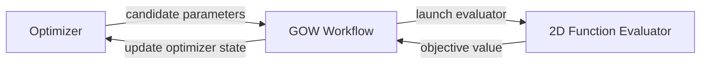
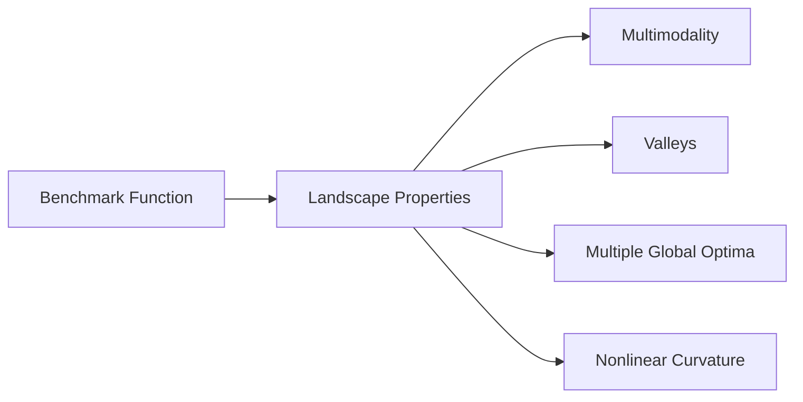
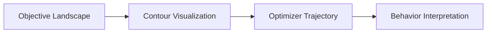
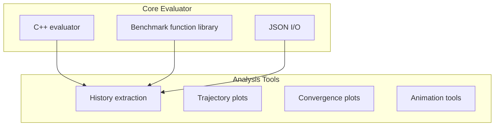
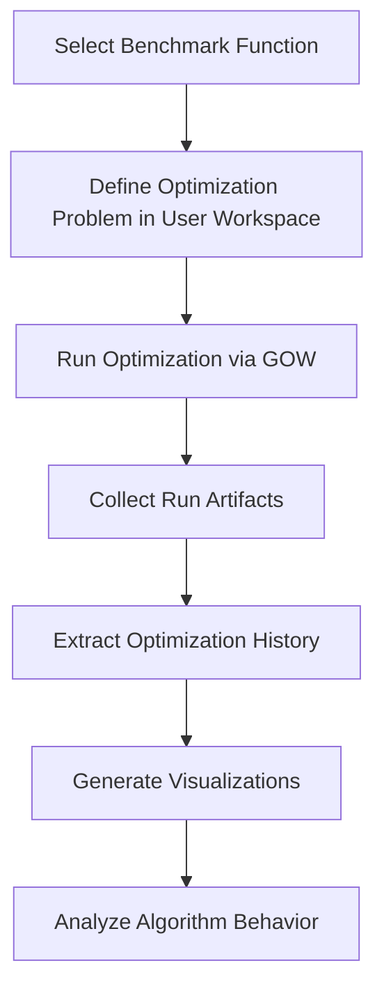

When developing optimization algorithms, it is often useful to begin with analytical benchmark functions before moving on to computationally expensive simulation models.

Benchmark functions provide controlled, reproducible problems where algorithm behavior can be studied, compared, and debugged without the overhead of a full simulation workflow.

Within the **Generic Optimization Workflow (GOW)** ecosystem, evaluators are the programs that compute objective values for candidate solutions. GOW is designed to work with external evaluators, so lightweight benchmark evaluators are a natural fit: they let us exercise the same workflow contract used in production, but on problems that are fast to run and easy to visualize.

The **2D Function Evaluator** was created for exactly that purpose. It evaluates a set of well-known two-dimensional benchmark functions, produces standard `input.json` / `output.json` artifacts, and includes Python tooling for visualization and post-run analysis.

The animation above shows the benchmark set currently included in the evaluator, using both contour and 3D surface views. Because these problems are two-dimensional, the objective landscape can be inspected directly, making it much easier to understand how an algorithm explores, converges, or gets trapped in local minima.

This post introduces the 2D Function Evaluator, explains how it fits into GOW, and shows how to use it both as a standalone tool and as a GOW-compatible external evaluator.

<!--truncate-->

For a broader introduction to GOW architecture and evaluator concepts, see:

**[GOW: Architecture, Evaluator Contract, and Usage](https://cst-modelling-tools.github.io/generic-optimization-workflow-blog/gow-architecture-and-usage)**

---

## Motivation

In real optimization workflows, objective evaluations are often the most expensive part of the process. They may involve:

- numerical simulations
- data-processing pipelines
- external engineering codes
- HPC workloads

While this is the natural target application for GOW, such expensive evaluations can make algorithm development slow and difficult.

During algorithm development, we often want to answer questions such as:

- Does the algorithm converge reliably?
- How does it behave in multimodal landscapes?
- Is the exploration-exploitation balance reasonable?
- Are population dynamics behaving as expected?

Benchmark functions are widely used in optimization research because they allow these questions to be explored quickly and reproducibly.

The **2D Function Evaluator** brings this capability directly into the GOW ecosystem while preserving the same evaluator interface used by real applications.

---

## Integration with GOW

GOW separates three main responsibilities:

- optimization algorithms
- workflow orchestration
- objective evaluation

The 2D Function Evaluator implements the same **external evaluator interface** used for real simulation codes.



The evaluator performs a simple sequence of operations:

1. Read candidate parameters from `input.json`
2. Evaluate the selected benchmark function
3. Write the result to `output.json`

Because it follows the same contract used by real evaluators, it can serve as a **drop-in test problem for optimization experiments**.

This allows algorithm development and workflow validation to happen in the same execution model later used for simulation-driven optimization.

---

## Installation

The 2D Function Evaluator is available on GitHub:

**https://github.com/CST-Modelling-Tools/2D-function-evaluator**

Clone the repository:

```bash
git clone https://github.com/CST-Modelling-Tools/2D-function-evaluator.git
cd 2D-function-evaluator
```

The project has two parts:

- a **C++ executable** that implements the evaluator contract
- optional **Python scripts** for visualization and post-processing

If you plan to use the evaluator together with GOW, it is recommended to install the Python dependencies in the **same virtual environment used by GOW**. That keeps the analysis tooling in one place and avoids environment mismatches.

Create and activate a virtual environment if needed.

On Linux or macOS:

```bash
python -m venv .venv
source .venv/bin/activate
```

On Windows PowerShell:

```powershell
python -m venv .venv
.venv\Scripts\Activate.ps1
```

Install the optional Python dependencies:

```bash
pip install -r scripts/requirements.txt
```

Build the C++ evaluator with CMake:

```bash
cmake -S . -B build
cmake --build build
```

After the build completes, CMake copies the executable to the repository-level `bin/` directory:

- Linux or macOS: `bin/2d-function-evaluator`
- Windows: `bin/2d-function-evaluator.exe`

This `bin/` location makes it easy to reference the evaluator from external tools such as GOW.

---

## Verifying the Installation

You can verify the installation in two quick ways.

First, list the built-in benchmark functions:

```bash
./bin/2d-function-evaluator --print-functions
```

On Windows PowerShell:

```powershell
.\bin\2d-function-evaluator.exe --print-functions
```

Second, generate the benchmark gallery and animated overview:

```bash
python scripts/plot_benchmark_functions.py \
  --out-dir artifacts/test \
  --gallery \
  --animated-gif
```

If these commands succeed, the evaluator and its optional visualization tooling are ready to use.

---

## Using the Evaluator Stand-Alone

The 2D Function Evaluator can also be used independently of GOW.

In standalone mode, it reads an `input.json` file and writes an `output.json` file that follows the same contract used inside GOW.

A minimal input file might look like:

```json
{
  "run_id": "demo-run",
  "candidate_id": "manual",
  "params": {
    "x": 0.1,
    "y": -0.3,
    "function": "rastrigin"
  },
  "context": {}
}
```

Then run the executable directly:

```bash
./bin/2d-function-evaluator --input input.json --output output.json
```

On Windows PowerShell:

```powershell
.\bin\2d-function-evaluator.exe --input input.json --output output.json
```

For this example, the resulting `output.json` would look like:

```json
{
  "status": "ok",
  "metrics": {
    "f": 15.099660112501051
  },
  "objective": 15.099660112501051
}
```

Here, `objective` is the scalar value used by GOW during optimization, and `metrics.f` stores the same function value inside the general metrics payload.

This standalone mode is useful for testing benchmark functions, validating the evaluator, or generating small reference datasets.

The repository also includes Python utilities for generating benchmark visualizations, including contour plots, 3D surface plots, gallery images, and animated overviews of the benchmark set.

These visualizations are useful for understanding optimization landscapes and documenting algorithm behavior.

---

## Using the Evaluator with GOW

The primary purpose of the 2D Function Evaluator is to act as an **external evaluator for GOW optimization runs**.

Because the evaluator already supports the standard interface, GOW can launch it exactly like any other external evaluator.

```text
<evaluator_exe> --input input.json --output output.json
```

During execution, GOW interacts with the evaluator through the standard evaluator contract:

- GOW writes candidate parameters to `input.json`
- the evaluator computes the objective value
- the result is written to `output.json`

Because the evaluator follows the same interface used for real simulation codes, optimization algorithms can be tested on analytical benchmark functions using the same workflow later applied to simulation-driven optimization problems.

---

## Configuring the Evaluator in a GOW Optimization Problem

In GOW, optimization problems are defined in a **user workspace** outside the GOW repository, typically in a YAML file such as `optimization_specs.yaml`. The filename itself is **not mandatory**: GOW does not require a special name, as long as you provide the path to that file when running `gow run` or `gow evaluate`.

In the current CLI, GOW expects the **path to the specification file**, not just the containing folder. If `--outdir` is not provided, GOW uses the parent directory of that YAML file to determine the default results location, typically creating a `results/` directory alongside the specification file.

To use the 2D Function Evaluator, the problem specification needs three things:

- an evaluator command that points to the built executable
- two optimizable parameters, `x` and `y`
- a fixed parameter named `function` that selects the benchmark function

A minimal example of such a YAML problem specification looks like this:

```yaml
id: rastrigin-demo

objective:
  direction: minimize

parameters:
  x:
    type: real
    value: 0.0
    bounds: [-5.12, 5.12]

  y:
    type: real
    value: 0.0
    bounds: [-5.12, 5.12]

  function:
    type: categorical
    value: rastrigin
    optimizable: false

evaluator:
  command: ["D:/OpenSource/2D-function-evaluator/bin/2d-function-evaluator.exe"]
  timeout_s: 60

optimizer:
  name: differential_evolution
  seed: 123
  max_evaluations: 200
  batch_size: 20
```

On Linux or macOS, the evaluator command would point to `bin/2d-function-evaluator` instead.

In this example, `optimizable: true` is not written for `x` and `y` because in GOW that field defaults to `true`. The `function` parameter is marked explicitly with `optimizable: false` because it must remain fixed during the optimization run.

This works because GOW writes all configured parameter values into `input.json` under the `params` object, and the evaluator reads `params.x`, `params.y`, and `params.function`.

For a broader explanation of GOW problem specifications, parameter definitions, and evaluator configuration, see:

**[GOW: Architecture, Evaluator Contract, and Usage](https://cst-modelling-tools.github.io/generic-optimization-workflow-blog/gow-architecture-and-usage)**

Once the specification is in place, a local optimization run can be started with:

```bash
gow run path/to/optimization_specs.yaml
```

For manual debugging of one candidate, GOW also provides:

```bash
gow evaluate path/to/optimization_specs.yaml \
  --run-id demo-run \
  --generation-id 0 \
  --candidate-index 0 \
  --param x=0.25 \
  --param y=-0.5
```

That command creates a candidate work directory, writes `input.json`, launches the evaluator, and records the result in the usual GOW artifact layout.

---

## Benchmark Functions

The evaluator currently includes the following two-dimensional benchmark functions:

| Function | Internal name | Characteristic |
|---|---|---|
| Sphere | `sphere` | Simple convex landscape |
| Rosenbrock | `rosenbrock` | Narrow curved valley |
| Rastrigin | `rastrigin` | Highly multimodal |
| Ackley | `ackley` | Large number of local minima |
| Himmelblau | `himmelblau` | Multiple global minima |
| Beale | `beale` | Complex polynomial landscape |
| Goldstein-Price | `goldstein_price` | Strongly nonlinear surface |
| McCormick | `mccormick` | Smooth surface with saddle regions |

These functions represent different classes of optimization challenges.



This diversity makes them useful for evaluating algorithm robustness and convergence behavior.

---

## Why Two-Dimensional Benchmarks?

Two-dimensional benchmark problems have a unique advantage: **they can be visualized directly**.

When the search space is two-dimensional, we can display:

- contour maps
- optimization trajectories
- population evolution
- convergence dynamics

These visualizations make it easier to understand how optimization algorithms explore the search space and approach optimal solutions.



Such insights are often difficult to obtain from objective values alone.

---

## Evaluator Architecture and Analysis Tools

The project combines two complementary layers:

- a **C++ evaluator**
- a **Python analysis and visualization toolkit**



The evaluator performs the objective computation, while the Python tools allow users to inspect and visualize optimization runs.

This separation keeps the evaluator lightweight while still providing practical tools for interpretation and visualization.

---

## Example Workflow

Once the evaluator is installed and configured in a GOW specification, a typical development workflow looks like this:



In practice, the workflow is straightforward:

1. Define a GOW optimization specification in your own workspace.
2. Point the evaluator command to the built 2D Function Evaluator executable.
3. Run the optimization with `gow run`.
4. Inspect the generated artifacts under the GOW results directory.
5. Use the evaluator's Python scripts to extract history and generate plots or animations.

Because benchmark evaluations are fast, this loop supports quick iteration when testing new algorithms, comparing strategies, or tuning hyperparameters.

For example, after a run completes, you can extract a `history.csv` from the run artifacts with:

```bash
python scripts/extract_history.py --run-dir <gow-run-dir> --out history.csv --pop-size 100
```

Then generate a trajectory plot:

```bash
python scripts/plot_trajectory.py --history history.csv --out trajectory.png
```

---

## Why This Tool Is Valuable

The 2D Function Evaluator provides several concrete benefits for the GOW ecosystem:

- **Rapid experimentation** with optimization algorithms on inexpensive test problems
- **Reproducible baselines** based on standard analytical benchmark functions
- **Workflow validation** through the same external evaluator mechanism used in real applications
- **Better interpretability** through contour plots, surfaces, and trajectory visualizations

Together, these features make the evaluator useful not only as a benchmarking tool but also as a development aid for the broader GOW ecosystem.

---

## Availability

The 2D Function Evaluator is available as an open-source project:

**https://github.com/CST-Modelling-Tools/2D-function-evaluator**

The Generic Optimization Workflow project can be found here:

**https://github.com/CST-Modelling-Tools/generic-optimization-workflow**

And the GOW Development Blog:

**https://cst-modelling-tools.github.io/generic-optimization-workflow-blog/**

---

## Conclusion

The **2D Function Evaluator** provides a simple yet powerful benchmark environment for testing optimization algorithms within the Generic Optimization Workflow.

By combining classical analytical functions with visualization tools and the standard GOW evaluator interface, it enables rapid experimentation while remaining fully compatible with the workflow architecture used for real optimization problems.

This makes it a valuable tool for algorithm development, workflow validation, and understanding optimizer behavior.

It also provides a practical bridge between optimization theory and workflow-driven experimentation, helping developers validate algorithms before applying them to more complex engineering models.
