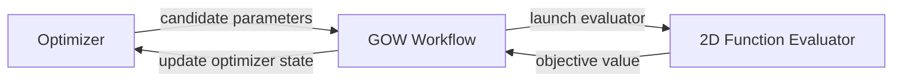
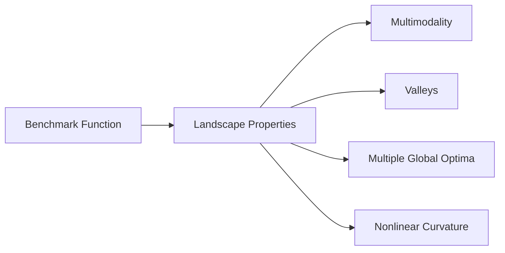
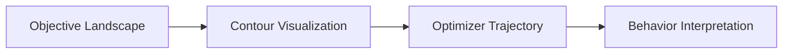
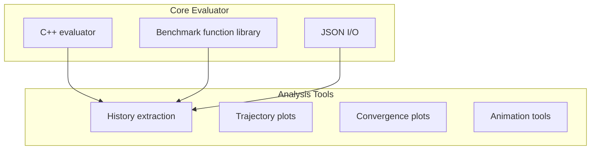
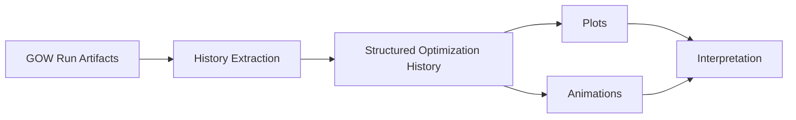
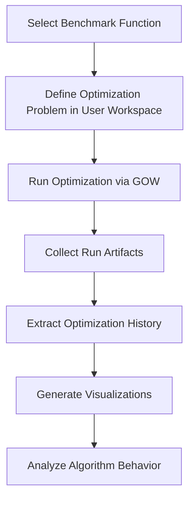

# A 2D Benchmark Function Evaluator for the Generic Optimization Workflow

When developing optimization algorithms it is often useful to test them on analytical benchmark functions before applying them to computationally expensive simulation models.

These functions provide controlled environments where algorithm behavior can be studied, compared, and debugged without the overhead of running full simulations.

Within the **Generic Optimization Workflow (GOW)** ecosystem, evaluators provide the interface between optimization algorithms and the underlying objective functions being optimized. While GOW is typically used to drive complex simulation workflows, it is also valuable to have lightweight evaluators that enable rapid experimentation with optimization strategies.

To support this, we developed the **2D Function Evaluator**, a small tool designed to evaluate and visualize common two-dimensional benchmark functions. It allows developers to test optimization algorithms used in GOW on well-known analytical problems before applying them to more expensive engineering models.

The animation at the start of this post shows the benchmark functions currently included in the evaluator, with both contour and 3D surface views.

By making these landscapes directly visible, the evaluator helps bridge the gap between abstract optimization concepts and the practical behavior of algorithms during a run. It provides a lightweight and reproducible environment for studying how optimizers explore, converge, and respond to different classes of objective landscapes.

This post introduces the 2D Function Evaluator, explains how it fits into the GOW architecture, and describes how it can be installed and used to experiment with optimization algorithms in a lightweight and reproducible environment.

<!--truncate-->

For a broader introduction to GOW architecture and evaluator concepts, see the post:

**[GOW: Architecture, Evaluator Contract, and Usage](https://cst-modelling-tools.github.io/generic-optimization-workflow-blog/gow-architecture-and-usage)**

---

# Motivation

In real optimization workflows, objective evaluations are often the most expensive part of the process. They may involve:

- numerical simulations
- data-processing pipelines
- external engineering codes
- HPC workloads

While this is the natural target application for GOW, such expensive evaluations can make algorithm development slow and difficult.

During algorithm development we often want to answer questions such as:

- Does the algorithm converge reliably?
- How does it behave in multimodal landscapes?
- Is the exploration–exploitation balance reasonable?
- Are population dynamics behaving as expected?

Benchmark functions are widely used in optimization research because they allow these questions to be explored quickly and reproducibly.

The **2D Function Evaluator** brings this capability directly into the GOW ecosystem while preserving the same evaluator interface used by real applications.

---

# Integration with GOW

GOW separates three main responsibilities:

- optimization algorithms
- workflow orchestration
- objective evaluation

The 2D Function Evaluator implements the same **external evaluator interface** used for real simulation codes.



The evaluator simply:

1. reads candidate parameters from `input.json`
2. evaluates the selected benchmark function
3. writes the result to `output.json`

Because it follows the same contract used by real evaluators, it can serve as a **drop-in test problem for optimization experiments**.

This is particularly useful because it allows algorithm development and workflow validation to happen in the same execution model later used for simulation-driven optimization.

---

# Installation

The 2D Function Evaluator is available as an open-source project on GitHub:

**[2D Function Evaluator repository](https://github.com/CST-Modelling-Tools/2D-function-evaluator)**

To get started locally, first clone the repository:

```bash
git clone https://github.com/CST-Modelling-Tools/2D-function-evaluator.git
cd 2D-function-evaluator
```

The project includes a C++ evaluator and Python scripts for analysis and visualization, so it is recommended to create a Python virtual environment before installing the Python dependencies.

On Linux or macOS:

```bash
python -m venv .venv
source .venv/bin/activate
pip install -r scripts/requirements.txt
```

On Windows PowerShell:

```powershell
python -m venv .venv
.venv\Scripts\Activate.ps1
pip install -r scripts/requirements.txt
```

The core evaluator is built with CMake. A typical build sequence is:

```bash
cmake -S . -B build
cmake --build build
```

Once built, the evaluator executable and the Python utilities are ready to use.

---

# Basic Usage

There are two main ways to use the project:

1. as an **external evaluator** invoked by GOW during optimization runs
2. as a **standalone benchmark and visualization tool** for exploring function landscapes and analyzing optimization behavior

When used through GOW, the evaluator participates in the same input/output contract as other evaluators. GOW writes the candidate parameters to `input.json`, launches the evaluator, and reads the objective value from `output.json`.

When used directly, the visualization utilities can be used to generate figures for documentation, inspection, and experimentation.

For example, the following command generates contour plots, 3D plots, a gallery image, and an animated GIF for the benchmark functions:

```bash
python scripts/plot_benchmark_functions.py \
  --out-dir artifacts/blog-figures \
  --gallery \
  --animated-gif
```

This produces:

- individual contour plots
- individual 3D surface plots
- combined contour + 3D frames
- a contour gallery
- an animated overview of the benchmark set

This makes the repository useful not only as an evaluator, but also as a compact benchmark visualization toolkit.

---

# Benchmark Functions

The evaluator currently includes several well-known two-dimensional benchmark functions used in optimization research.

| Function | Characteristic |
|---|---|
| Sphere | Simple convex landscape |
| Rosenbrock | Narrow curved valley |
| Rastrigin | Highly multimodal |
| Ackley | Large number of local minima |
| Himmelblau | Multiple global minima |
| Beale | Complex polynomial landscape |
| Goldstein-Price | Strongly nonlinear surface |
| McCormick | Smooth surface with saddle regions |

These functions represent different classes of optimization challenges.



Such diversity makes them useful for evaluating algorithm robustness and convergence behaviour.

Using the visualization tools included in the repository, these functions can also be inspected directly as contour maps and 3D surfaces, making it easier to understand why some algorithms perform well on certain landscapes and struggle on others.

---

# Why Two-Dimensional Benchmarks?

Two-dimensional benchmark problems have a unique advantage: **they can be visualized directly**.

When the search space is two-dimensional we can easily display:

- contour maps
- optimization trajectories
- population evolution
- convergence dynamics

This makes it much easier to understand how an optimization algorithm behaves.



Such visualizations often reveal algorithmic behaviors that cannot be inferred from objective values alone.

This is one of the main reasons why the 2D Function Evaluator is useful during development: it provides a visually interpretable environment in which algorithmic behavior can be inspected before moving to higher-dimensional or simulation-based problems.

---

# Evaluator Architecture

The project combines two complementary layers:

- a **C++ evaluator**
- a **Python analysis and visualization toolkit**



The evaluator performs the objective computation, while the Python tools allow users to inspect and visualize the results of optimization runs.

This separation keeps the evaluator lightweight and efficient while still providing richer tooling for interpretation and presentation.

---

# Visualization and Analysis

The repository also includes scripts for analyzing optimization runs and visualizing algorithm behavior.

These tools can generate:

- trajectory plots on contour maps
- convergence curves
- population evolution across generations
- animated visualizations of optimization processes



Such visualizations help diagnose algorithm behavior and support comparative studies between optimization methods.

They also make the project especially useful for communication and teaching, since benchmark landscapes and optimizer trajectories can be shown in a way that is immediately understandable.

---

# Example Workflow

A typical development workflow using the evaluator might look like this:



In GOW, optimization problems are **not configured inside the GOW repository itself**. Instead, they are defined in a **user-controlled workspace** that contains the optimization specification and experiment configuration.

GOW then orchestrates the execution of the workflow, launches the evaluator, and records the resulting artifacts.

Because benchmark evaluations are extremely fast, this loop allows rapid experimentation when testing new algorithms, comparing optimization strategies, or tuning algorithm parameters.

This staged process makes it possible to identify algorithmic issues early, before moving on to more expensive evaluators based on external simulation workflows.

---

# Why This Tool Is Valuable

The 2D Function Evaluator provides several benefits for the GOW ecosystem.

**Rapid experimentation**

Benchmark functions allow optimization algorithms to be tested quickly.

**Reproducible experiments**

Analytical landscapes provide well-known baselines for algorithm comparison.

**Workflow validation**

The evaluator exercises the same external evaluation mechanism used in real applications.

**Better understanding of algorithm behavior**

Visualization tools make optimizer dynamics easier to interpret.

Taken together, these properties make the evaluator useful not only as a benchmarking tool, but also as a development aid for the broader GOW ecosystem.

---

# Availability

The 2D Function Evaluator is available as an open-source project:

**[2D Function Evaluator repository](https://github.com/CST-Modelling-Tools/2D-function-evaluator)**

The Generic Optimization Workflow project can be found here:

**[Generic Optimization Workflow repository](https://github.com/CST-Modelling-Tools/generic-optimization-workflow)**

And the GOW Development Blog:

**[GOW Development Blog](https://cst-modelling-tools.github.io/generic-optimization-workflow-blog/)**

---

# Conclusion

The **2D Function Evaluator** provides a simple yet powerful benchmark environment for testing optimization algorithms within the Generic Optimization Workflow.

By combining classical analytical functions with visualization tools and the standard GOW evaluator interface, it enables rapid experimentation while remaining fully compatible with the workflow architecture used for real optimization problems.

This makes it a valuable tool for algorithm development, experimentation, and understanding optimization behavior.

At the same time, it offers a practical and visually interpretable bridge between optimization theory and workflow-driven experimentation, which is particularly useful when developing and validating optimization algorithms before applying them to complex engineering problems.